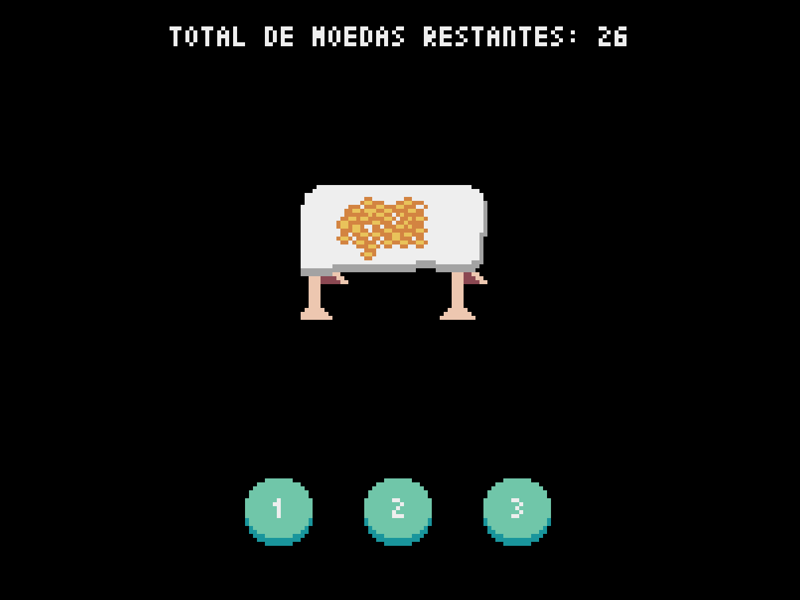

**Número da Lista**: X
**Conteúdo da Disciplina**: PD

## Alunos
|Matrícula | Aluno |
| -- | -- |
| 19/0026758 |  Deivid Alves de Carvalho  |
| 19/0030879 |  João Pedro Moura Oliveira |

## Sobre 
#### O Último Moedeiro é um jogo em que dois jogadores combatem pela útlima moeda do monte.
- O jogo inicia-se com uma quantidade <b>n</b> de moedas, e a cada rodada cada jogador pode retirar 1, <b>x</b> ou <b>y</b> moedas desse monte.
- Para a resolução desse problema, utiliza-se uma ideia semelhante àquela presente na sequência de Fibonacci utilizando Programação Dinâmica. Ou seja, a cada interação alguns valores são salvos no vetor memoization que pode ser consultados em O(1) sem a necessidade de um novo cálculo.
- Portanto, a solução ótima possui uma complexidade de O(n) visto que cada valor só precisa ser calculado uma vez e não sendo necessária nenhuma análise posterior.

## Screenshots
### Jogando O Último Moedeiro


### Tela do Menu


### Tela do Jogo


## Instalação 
**Linguagem**: python<br>
**Framework**: pyxel<br>

### Pré-requisitos
```
# Instalação do Pyxel
pip install pyxel

# Clonagem do repositório
git clone git@github.com:projeto-de-algoritmos/PD_O-ultimo-moedeiro.git

# Entre na pasta
cd PD_O-ultimo-moedeiro
```

## Uso 
- Após a instalação dos pré-requisitos é necessário rodar o seguinte comando:
```
python app.py
```

- Para jogar deve-se selecionar a quantidade de moedas do jogo (primeiro valor da esquerda pra direita) e o primeiro e o segundo valor (x e y) de moedas que podem ser retiradas a cada rodada (segundo e terceiro valor da esquerda para a direita).

## Informações Extras (IMPORTANTE)
- Vale ressaltar que o primeiro valor deve ser sempre maior ou igual ao terceiro valor, o segundo sempre maior que 1 e menor que o terceiro valor e por fim o terceiro valor deve ser sempre maior que o segundo e menor ou igual ao primeiro.
